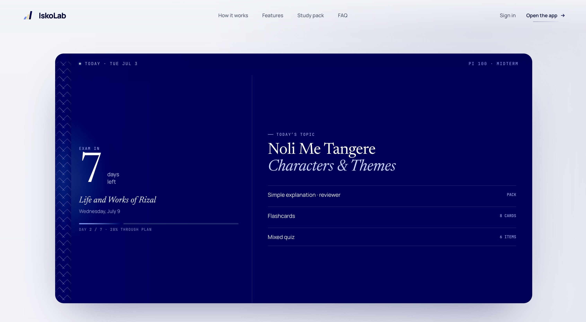

# IskoLab



**IskoLab is an AI-assisted exam preparation prototype for students who need a clear daily plan, simple explanations, and practice generated from their own class material.**

It turns a student’s exam date, topic list, notes, and modules into a focused study loop: plan the days, generate a study pack, practice recall, and repair weak items before exam day.

---

## Why IskoLab exists

Most study tools start from generic content. IskoLab starts from the student’s actual situation:

- an exam date
- a subject and topic list
- uploaded notes or pasted module text
- the language the student actually thinks in
- the weak items that need review before the exam

The product thesis is simple:

> When explanation becomes abundant, direction becomes the scarce thing.

IskoLab is designed to give students that direction — what to study today, how to understand it, what to practice, and what to return to before the exam.

---

## Product surfaces

### Landing page

`IskoLab Landing.dc.html`

A high-production product landing page with:

- cinematic hero preview
- deep-blue IskoLab visual language
- report-style Vision section
- study-pack product explanation
- scroll-driven feature carousel
- minimal FAQ reveal system
- responsive desktop/mobile behavior

### Web dashboard

`IskoLab Web.dc.html`

A desktop-oriented study workspace with:

- Today plan
- Study Pack
- Flashcards
- Mixed quiz
- Progress surfaces
- contextual back navigation
- prototype reset controls

### PWA/mobile app shell

`IskoLab App.dc.html`

A mobile-first shell designed for phone-browser or Add-to-Home-Screen usage.

---

## Core study loop

1. **Set the exam**  
   Add the subject, exam date, and topic list.

2. **Add material**  
   Paste notes or upload module text/PDF-derived content.

3. **Generate a study pack**  
   Get a simple explanation, reviewer outline, key terms, and practice set.

4. **Practice recall**  
   Use flashcards and quizzes to test understanding.

5. **Repair weak items**  
   Missed items stay visible so the student can return before exam day.

---

## Vision

IskoLab is not meant to be just another AI wrapper.

The deeper direction is a learning context engine: a calm instrument that remembers the student’s materials, deadline, weak spots, language preference, and daily practice history.

In a future where AI can explain almost anything, IskoLab asks a more grounded question:

> What is the next honest learning action for this student, today?

That is the product center.

---

## Design language

IskoLab uses a restrained academic-future visual system:

- deep blue as the core intelligence layer: `rgb(14, 23, 90)`
- soft companion glow: `#7E9CFF`
- warm cream accent: `#F3E5B8`
- thin rules, quiet metadata, report-like hierarchy
- spacious cards and instrument-like surfaces
- motion that feels calm, expensive, and reversible

The intent is not decorative sci-fi. The intent is a study instrument that feels serious, warm, and future-facing.

---

## Running locally

This prototype is currently composed as standalone HTML files.

Open the landing page directly in a browser:

```bash
open "IskoLab Landing.dc.html"
```

Open the desktop web app:

```bash
open "IskoLab Web.dc.html"
```

Open the mobile/PWA shell:

```bash
open "IskoLab App.dc.html"
```

The landing page routes `Open the app` based on device context:

- desktop/web → `IskoLab Web.dc.html`
- mobile/coarse pointer/PWA → `IskoLab App.dc.html`

---

## Repository structure

```txt
.
├── assets/
│   └── readme-cover.jpeg
├── IskoLab Landing.dc.html
├── IskoLab Landing (standalone).html
├── IskoLab Web.dc.html
├── IskoLab App.dc.html
├── IskoLab Exam Prep MVP.dc.html
├── iskolab-data.js
├── support.js
└── README.md
```

---

## Status

Prototype / concept build.

Current mock profile data:

- **Name:** Janrey Murcia
- **School:** Ateneo de Davao University
- **Course & Year:** BS Astronomy, 1st Year

---

## Built with

- HTML
- CSS
- JavaScript
- single-file prototype architecture
- responsive web/PWA routing

---

## License

No license has been declared yet.
